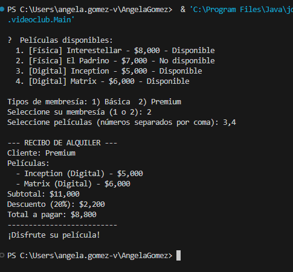

# Autora: Ángela Gómez

# ACTIVIDAD GENERACIÓN DE SOLUCIONES CON IA GENERATIVA

# PRLOBLEMA 1 - EL VIDEOCLUB DE DON MARIO

# PROMPTS

## PROMPT PRINCIPAL

Necesito que por favor me ayudes a generar código de forma efectiva, de tal forma que me ayude a obtener los siguientes resultados:

Identificar cual o cuales patrones de diseno utilizar.
Explicar que principios de SOLID se aplican.
Aplicar polimorfismo y encapsulamiento.
Colocar evidencia de la ejecucion del ejercicio (ejecucion por consola; no es necesario hacer front).
Entonces el ejercicio a solucionar es el siguiente:

Duración: Máximo 15 minutos
Don Mario acaba de abrir un videoclub moderno donde los clientes pueden alquilar peliculas fisicas o digitales. El problema es que su sistema anterior era un caos: todos los precios se calculaban igual sin importar el tipo de pelicula o membresia del cliente, y no habia forma de saber que peliculas estaban disponibles en tiempo real.
Tu Mision
Ayuda a Don Mario creando un sistema de alquiler que permita:

Registrar peliculas (fisicas o digitales) con su disponibilidad.
Que el cliente elija X peliculas para alquilar.
Calcular el precio total segun su tipo de membresia:
Basica: precio normal.
Premium: 20% de descuento.
Mostrar al finalizar un recibo con las peliculas, precio por unidad y total.
Peliculas Disponibles

[Fisica] Interestellar - $8.000 - Disponible
[Fisica] El Padrino - $7.000 - No disponible
[Digital] Inception - $5.000 - Disponible
[Digital] Matrix - $6.000 - Disponible
El caso de ejemplo para este ejercicio es el siguiente

Membresia del cliente: Premium Seleccione peliculas (numeros separados por coma): 1,3

--- RECIBO DE ALQUILER ---
Cliente: Premium
Peliculas:
 - Interestellar (Fisica) - $8.000
 - Inception (Digital) - $5.000
Subtotal: $13.000
Descuento (20%): $2.600
Total a pagar: $10.400
--------------------------
¡Disfrute su pelicula!
Entonces necesito que me señales con claridad las diferentes clases que creo, con documentación pertinente pero NO redundante. Si consideras que hay alguna línea de código que no sea tan intuitiva, añade un comentario al lado de esa línea para indicar qué hace dicha línea de código. 

NO me hagas usar paquetes o carpetas, pues quiero que la solución sea puntual sin una estructura compleja a nivel de scaffolding. 

Revisa bien el código antes de mandarlo pls.

## SEGUNDO PROMPT

En java, no en python por favor
entonces dame un código por clase por favor, y dame lo que me acabaste de mandar pero listo para copiar y pegar en un código readme

# Estructura sugerida

videoclub/

├── MembresiaStrategy.java   # Interfaz Strategy (contrato de descuento)

├── MembresiaBasica.java     # Strategy concreta — sin descuento

├── MembresiaPremium.java    # Strategy concreta — 20 % de descuento

├── Pelicula.java            # Clase abstracta base (Template Method)
├── PeliculaFisica.java      # Subclase — soporte físico

├── PeliculaDigital.java     # Subclase — formato digital

├── SistemaAlquiler.java     # Orquestador: catálogo + recibo

└── Main.java                # Punto de entrada

# PATRONES DE DISEÑO USADOS

Strategy — es el patrón principal. El cálculo del precio varía según la membresía, por lo que MembresiaBasica y MembresiaPremium son dos estrategias concretas que implementan la misma interfaz (MembresiaStrategy). SistemaAlquiler no sabe cuál es; simplemente llama aplicar_descuento(). Agregar una membresía "VIP" en el futuro es crear una clase nueva, nada más.

Template Method (parcial) — Pelicula define la estructura fija de toda película (título, precio, disponibilidad, nombre_completo()) y delega a las subclases únicamente el método tipo(), que es lo único que varía entre PeliculaFisica y PeliculaDigital.

# PRINCIPIOS SOLID

# RESULTADOS DESPUÉS DE LOS 2 PROMPTS

Después de los 2 prompts y de la generación de 8 clases, se resuelve exitosamente el problema. 

---

# PRLOBLEMA 2 - TIENDA VIRTUAL

# PROMPTS

## PROMPT PRINCIPAL